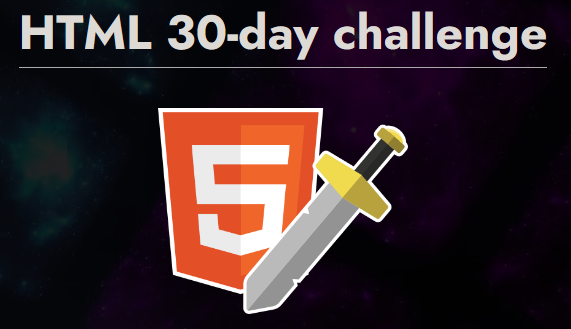

# HTML - 30 - DAY CHALLENGE

Repositorio para realizar los retos propuestos de **HTML** por [Manzdev](https://github.com/ManzDev) en [https://lenguajehtml.com/challenge](https://lenguajehtml.com/challenge)

[Aquí puedes ver mis soluciones para los retos](https://murquisdev.github.io/HTML-30-day-challenge/)

| #  | Reto                                                                                                                  | Solución          | Web |
|----|-----------------------------------------------------------------------------------------------------------------------|-------------------|-----|
| 01 | Crea una página HTML con código CSS desde un archivo diferente.                                                       | 📁 [01/](/dia01/) |[Día 01](https://murquisdev.github.io/HTML-30-day-challenge/dia01/index.html) |
| 02 | Crea una página con un titular, varios párrafos de texto y una imagen.                                                | 📁 [02/](/dia02/) |[Día 02](https://murquisdev.github.io/HTML-30-day-challenge/dia02/index.html) |
| 03 | Construye una página con un párrafo que tenga enlaces internos y externos (a otros sitios web).                       | 📁 [03/](/dia03/) |[Día 03](https://murquisdev.github.io/HTML-30-day-challenge/dia03/index.html) |
| 04 | Valida el código HTML de tus ejemplos anteriores (y los siguientes a partir de ahora).                                | 📁 [04/](/dia04/) |[Día 04](https://murquisdev.github.io/HTML-30-day-challenge/dia04/index.html) |
| 05 | Ponle un título y una descripción al documento, ideal para SEO.                                                       | 📁 [05/](/dia05/) |[Día 05](https://murquisdev.github.io/HTML-30-day-challenge/dia05/index.html) |
| 06 | Crea un grupo de secciones (acordeón) donde se despliegue sólo uno a la vez.                                          | 📁 [06/](/dia06/) |[Día 06](https://murquisdev.github.io/HTML-30-day-challenge/dia06/index.html) |
| 07 | Coloca una imagen en formato JPEG-XL. Si el navegador no la soporta, que use AVIF. Sino, que use JPG.                 | 📁 [07/](/dia07/) |[Día 07](https://murquisdev.github.io/HTML-30-day-challenge/dia07/index.html) |
| 08 | Crear un párrafo de texto con palabras destacadas en diferentes colores.                                              | 📁 [08/](/dia08/) |[Día 08](https://murquisdev.github.io/HTML-30-day-challenge/dia08/index.html) |
| 09 | Crea un pergamino con una lista de objetos, donde se numere con números romanos (mayúsculas).                         | 📁 [09/](/dia09/) |[Día 09](https://murquisdev.github.io/HTML-30-day-challenge/dia09/index.html) |
| 10 | Inserta un video de Youtube en una página y estila con CSS para que se vea bien.                                      | 📁 [10/](/dia10/) |[Día 10](https://murquisdev.github.io/HTML-30-day-challenge/dia10/index.html) |
| 11 | Escribe un texto con super/subíndices (fórmulas químicas, por ejemplo).                                               | 📁 [11/](/dia11/) |[Día 11](https://murquisdev.github.io/HTML-30-day-challenge/dia11/index.html) |
| 12 | Crea un slider que permita seleccionar un número entre 1-50 y lo muestre en vivo al cambiar.                          | 📁 [12/](/dia12/) |[Día 12](https://murquisdev.github.io/HTML-30-day-challenge/dia12/index.html) |
| 13 | Crea una barra medidora que muestre los tickets vendidos en un cine (64/100 tickets vendidos).                        | 📁 [13/](/dia13/) |[Día 13](https://murquisdev.github.io/HTML-30-day-challenge/dia13/index.html) |
| 14 | Muestra un bloque de fragmento de código CSS en una página (sin resaltado de colores).                                | 📁 [14/](/dia14/) |[Día 14](https://murquisdev.github.io/HTML-30-day-challenge/dia14/index.html) |
| 15 | Crea una página con un video MP4, que muestre una portada antes de darle a reproducir.                                | 📁 [15/](/dia15/) |[Día 15](https://murquisdev.github.io/HTML-30-day-challenge/dia15/index.html) |
| 16 | Muestra un texto con el atajo de teclado CTRL+ALT+SUPR y dale estilo para que parezcan teclas.                        | 📁 [16/](/dia16/) |[Día 16](https://murquisdev.github.io/HTML-30-day-challenge/dia16/index.html) |
| 17 | Crea una card de usuario: username como título, un avatar, edad, país, nacimiento y enlace a su web.                  | 📁 [17/](/dia17/) |[Día 17](https://murquisdev.github.io/HTML-30-day-challenge/dia17/index.html) |
| 18 | Crea un pequeño artículo de prensa con una noticia inventada. Usa etiquetas HTML semánticas.                          | 📁 [18/](/dia18/) |[Día 18](https://murquisdev.github.io/HTML-30-day-challenge/dia18/index.html) |
| 19 | Crea una tabla con información. Incluye una cabecera y un pie de tabla. La última columna será de un color diferente. | 📁 [19/](/dia19/) |[Día 19](https://murquisdev.github.io/HTML-30-day-challenge/dia19/index.html) |               |
| 20 | Crea un formulario para dejar un comentario en una página: Usuario y comentario de texto.                             |                |
| 21 | Crea una lista desplegable donde se pueda seleccionar entre 3 grupos de productos ficticios.                          |                |
| 22 | En la lista anterior, permite al usuario introducir opciones personalizadas y filtrar de datos.                       |                |
| 23 | Crea un formulario que te permita elegir un día entre el 15/nov y el 15/dic.                                          |                |
| 24 | Crea un formulario de registro que valide si el username escrito es válido (sólo letras y números) o no.              |                |
| 25 | Crea una galería de fotos. Asegúrate que no se cargan si están fuera de la región visible del navegador.              |                |
| 26 | Crea un mensaje emergente al pulsar un botón, que desaparezca al pulsar fuera del mensaje.                            |                |
| 27 | Crea una serie de etiquetas que permitan mostrar como miniatura una imagen en redes sociales.                         |                |
| 28 | Crea una ventana modal que bloquee la interación con otros botones. Requiere un poco de Javascript.                   |                |
| 29 | Crea un sistema de pestañas (tabs) para mostrar información. Necesita algo de Javascript.                             |                |
| 30 | Carga una librería Javascript de confetti y lánzalo cuando pulses en un botón. Requiere algo de Javascript.           |                |